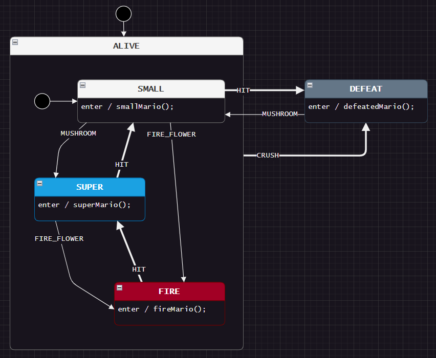
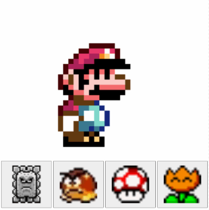

# Let's try it quick!
This tutorial is specific to draw.io. [Tutorial 3 covers PlantUML](https://github.com/StateSmith/tutorial-3).

The first design we will look at is a small Hierarchical State Machine (HSM) that represents the state of Mario in a game.



As you complete the lessons in this tutorial, you'll be able to interact with the generated state machines in your web browser. One of the later lessons will be programming language specific.



<br>
<br>

# Download This Tutorial
You should download the full contents of this tutorial to your computer so that you can follow along with the examples and complete the exercises.

[Click here](https://github.com/StateSmith/tutorial-4/archive/refs/heads/main.zip), or click the green "Code" button at the top of the Github page and select "Download ZIP".

Then unzip the contents to a location on your computer where you can easily access them.


<br>


# Download or Install the StateSmith CLI
There are two main ways to run the StateSmith CLI:
1. Download the pre-built binary for your computer (no need for dotnet, no need to install anything).
2. Install the StateSmith CLI using the dotnet SDK.

Follow [the instructions here](https://github.com/StateSmith/StateSmith/wiki/CLI:-Download-or-Install) for the method that you prefer.


<br>

# Quick Test of the StateSmith CLI
Let's test the StateSmith CLI to make sure it is working. Run the following command in your terminal:

```sh
ss.cli --version
```
You should see output similar to the following:

```
Using settings directory: /home/afk/.config/StateSmith.Cli
StateSmith.Cli 0.14.0+4a4e30018e9a371124530fa96cf2ba3322b80459
```

Make sure the version is at least `0.11.0`. I generally recommend using the latest version available.

We will cover the most important commands in this tutorial, but if you are curious, you can find additional [usage information here](https://github.com/StateSmith/StateSmith/wiki/CLI:-Usage).


<br>

# Download draw.io
I recommend downloading the official desktop version of draw.io from https://www.drawio.com/ (which links to their [github releases page](https://github.com/jgraph/drawio-desktop/releases/)).

⚠️ You can also use the **UNOFFICIAL** vscode extension, but it is rarely updated and is missing many bug fixes and features. If you use the vscode extension, do NOT use `.drawio.svg` files as the extension has numerous bugs with them. It is a pretty good extension for `.drawio` files though... usually... am I making you nervous yet? 😅 Best to start with the official draw.io program :)


<br>


# Onwards! ⏭️
Navigate to [lesson-1](./lesson-1/README.md) and see the readme there.
