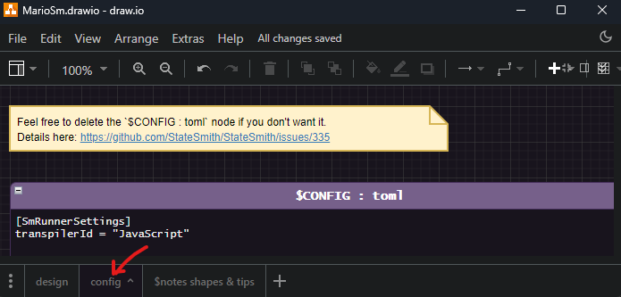
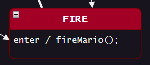

> [🎥 A video for this lesson is available](https://www.youtube.com/watch?v=sgDdOjf8gcU&list=PLC7mUEDZkCILp_Xvi6wjHv2EqMn_MbEXl&index=2).


# Make Mario Dance!
In this lesson, we are going to run the StateSmith CLI to generate a state machine from a draw.io diagram. We will then interact with the state machine using a simple html/javascript page.

Prerequisites: be able to run `ss.cli` as explained in the main [../README.md](../README.md) file.


<br>

# Where is my preferred programming language?
Don't worry, there is a language specific example in a later lesson.

All the **non**-language specific examples will use html/javascript because everyone has a browser that can run them.


<br>

# Code Generation
In this directory (`lesson-1`) run the following command to run StateSmith <u>h</u>ere (in this directory).

```sh
ss.cli run -h
```

You should see output similar to the following:

```
<snip>

StateSmith Runner - Compiling file: `MarioSm.drawio` (no state machine name specified).
StateSmith Runner - State machine `MarioSm` selected.
StateSmith Runner - Writing to file `MarioSm.js`
StateSmith Runner - Writing to file `MarioSm.sim.html`
StateSmith Runner - Finished normally.

<snip>
```

This output indicates that the StateSmith CLI has successfully generated the code for the `MarioSm` state machine.


<br>

# Interact With The State Machine
Open `index.html` in your web browser and press buttons to send events to the state machine.


<br>


# Open the Diagram
Open `MarioSm.drawio` in draw.io to see the state machine diagram.

At the bottom of the diagram, you will see multiple pages.

When `ss.cli` generates you a new draw.io file, it creates 3 pages for you:

1. `design` - the state machine diagram
1. `config` - where you can specify StateSmith settings
1. `$notes shapes & tips` - a page with template shapes and helpful tips


## Config Page
The config page in the `MarioSm.drawio` file contains a special [TOML](https://toml.io/en/) block that can be used to configure StateSmith settings. This is where you can specify the transpiler to use, and other settings.



<br>

You will often see TOML settings written like this:

```TOML
[SmRunnerSettings]
transpilerId = "JavaScript"
```

or like this:

```TOML
SmRunnerSettings.transpilerId = "JavaScript"
```

Both are equivalent.

StateSmith [Settings are documented here](https://github.com/StateSmith/StateSmith/blob/main/docs/settings.md).


<br>

# StateSmith Runs Your Exact Code
By default, StateSmith outputs the **exact same action code** you put in your diagram. In this case, it is calling global functions (written by the user), but we'll also cover other ways for your state machine to interact with the outside world.





```javascript
// global user written function called by the state machine
function fireMario() {
    marioImg.src = "img/fire-mario-dance.gif"
}
```


<br>

# Check Out The Simulator
Open `MarioSm.sim.html` in your browser to see the state machine simulator.

The simulator is a brand new (and improving) tool that allows you to interact with the state machine and see the state machine's behavior. Very useful for understanding a state machine's behavior.

🔥 While it is working well, the simulator does have a number of [quirks and limitations](https://github.com/StateSmith/StateSmith/wiki/Simulator) to be aware of.


<br>


# Onwards! ⏭️
Next we are going to quickly create a brand new state machine using the StateSmith CLI.

Head on over to [lesson 2 README.md](../lesson-2/README.md).
